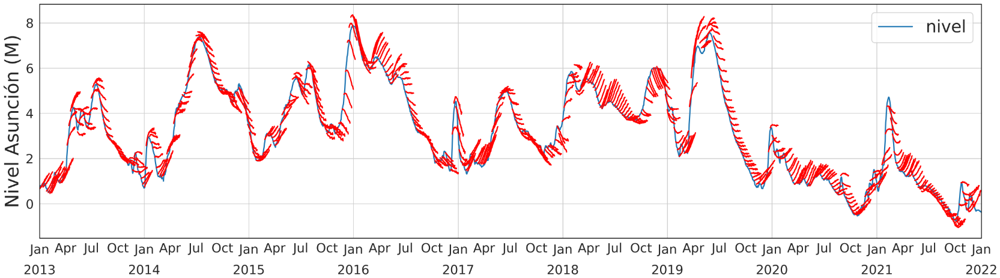

# Predicción del Nivel del Río Paraguay mediante Redes Neuronales Recurrentes

**Facultad de Ingeniería – Universidad Nacional de Asunción (FIUNA)**  
*Cátedra de Inteligencia Artificial*
---

## Resultados: Ventana de Predicción


*Figura 1: Visualización comparativa entre los valores reales hidrométricos y la ventana de predicción generada por el modelo.*

---
Documento que resume el proceso desde el primer parcial hasta el final :

* **Informe del Proyecto (PDF):** [Consultar documento PDF](<Presentación de Resultados/Predicción Nivel de Ríos.pdf>)
## Descripción del Proyecto

Este proyecto aborda el desarrollo e implementación de modelos de aprendizaje profundo (*Deep Learning*) para el pronóstico y predicción del nivel del río Paraguay mediante el análisis de series temporales. Se evalúa el desempeño de distintas arquitecturas de Redes Neuronales Recurrentes (RNN) para optimizar el ajuste temporal e hidrológico.

Las arquitecturas implementadas y comparadas son:
* **LSTM** (*Long Short-Term Memory*)
* **GRU** (*Gated Recurrent Unit*)
* **BiGRU** (*Bidirectional Gated Recurrent Unit*)

Para maximizar el rendimiento predictivo, la selección e hiperparametrización de los modelos se realiza de manera automatizada utilizando la librería **Optuna**.

---

## Objetivos

* Desarrollar modelos predictivos de alta precisión para la estimación de niveles hidrométricos en el río Paraguay.
* Realizar un análisis comparativo formal entre las arquitecturas RNN (LSTM, GRU y BiGRU).
* Optimizar la convergencia y los hiperparámetros de las redes mediante búsqueda automatizada con Optuna.
* Aportar herramientas analíticas orientadas al monitoreo y la prevención de eventos hidrológicos extremos.

---

## Tecnologías y Librerías

* **Lenguaje de Programación:** Python 3.10+
* **Marco de Aprendizaje Profundo:** TensorFlow / Keras
* **Procesamiento y Análisis de Datos:** Pandas, NumPy
* **Modelado y Métricas:** Scikit-learn
* **Optimización de Hiperparámetros:** Optuna
* **Visualización de Datos:** Matplotlib, Seaborn

---

## Estructura del Repositorio

```text
Prediccion-de-nivel-de-rios/
├── codigos/            # Scripts de procesamiento, entrenamiento y evaluación
├── datasets/           # Conjuntos de datos históricos del nivel del río
├── Final/              # Evaluación final y consolidado del proyecto
├── images/             # Visualizaciones, gráficos de convergencia y predicciones
├── Primer_parcial/     # Material y entregables correspondientes a la Etapa 1
├── Segundo_Parcial/    # Material y entregables correspondientes a la Etapa 2
├── Final/              # Evaluación final y consolidado del proyecto
└── README.md           # Documentación principal del repositorio